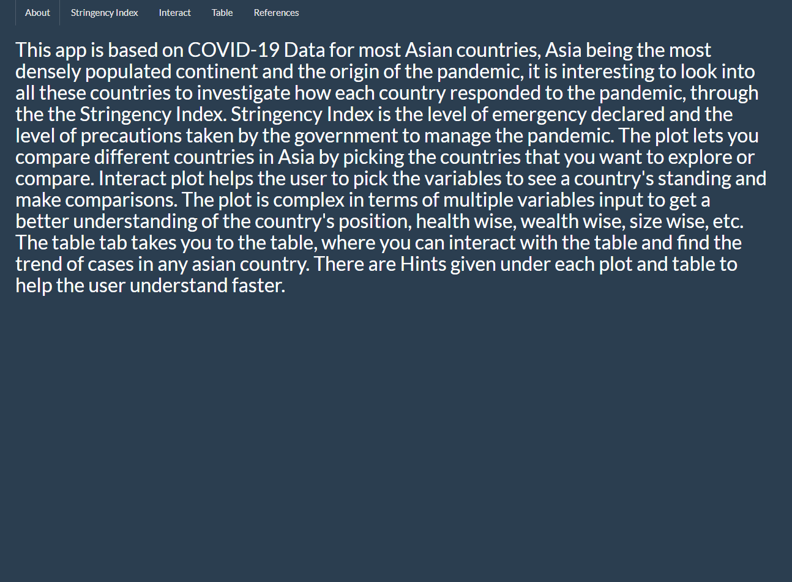

<!-- README.md is generated from README.Rmd. Please edit that file -->

```{r, include = FALSE}
knitr::opts_chunk$set(
  collapse = TRUE,
  comment = "#>",
  fig.path = "man/figures/README-",
  out.width = "100%"
)
```

# covidham

<!-- badges: start -->
[](https://github.com/etc5523-2020/r-package-assessment-msobanq/actions)
<!-- badges: end -->

The goal of covidham is to is for user to get access to the covid data set, functions and the application.

## Installation

<!-- You can install the released version of covidham from [CRAN](https://CRAN.R-project.org) with: -->

<!-- ``` r -->
<!-- install.packages("covidham") -->
<!-- ``` -->
Access the development version from [GitHub](https://github.com/etc5523-2020/r-package-assessment-msobanq) with:

``` r
# install.packages("devtools")
devtools::install_github("etc5523-2020/r-package-assessment-msobanq")
```
## Example

This is a basic example which shows you how to solve a common problem:

```{r example, message = FALSE, warning = FALSE, eval = FALSE, echo=TRUE}
library(covidham)
library(tibble)
library(dplyr)


# data set used in the app, and loaded into the package for user to use

covid_data 
```

This function will allow the users to get access to one of the plots from the app.

```{r, eval = FALSE, echo=TRUE}
covidham::stringency()
```

To launch the app use the function 

```{r, eval = FALSE, echo=TRUE}
covidham::launch_app()
```

Launching the app should take you to this page of the app





